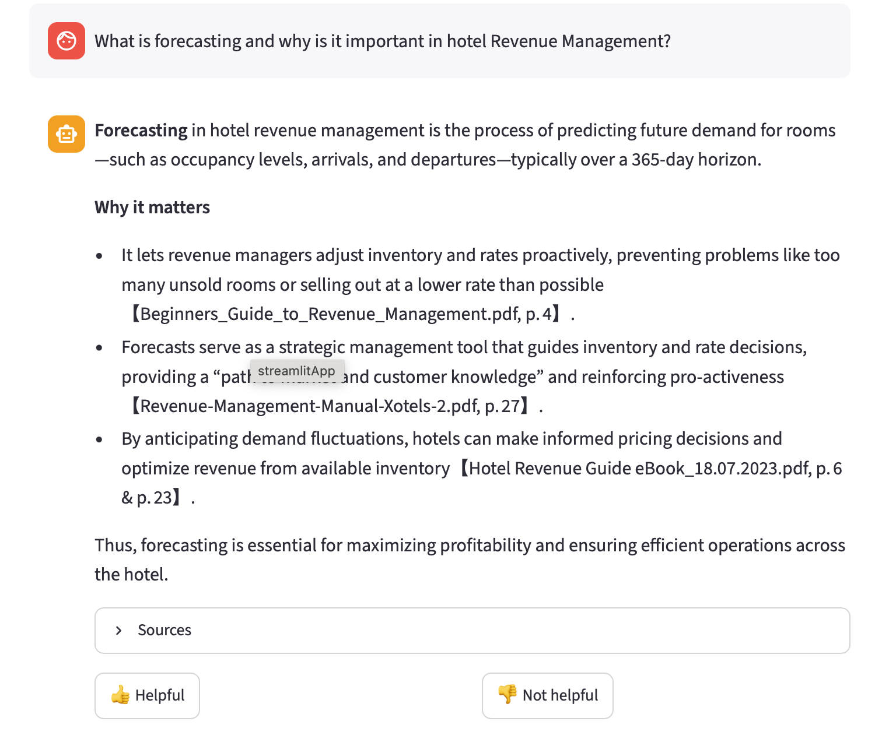
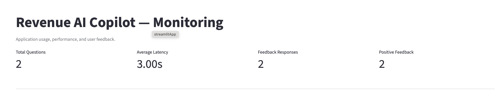
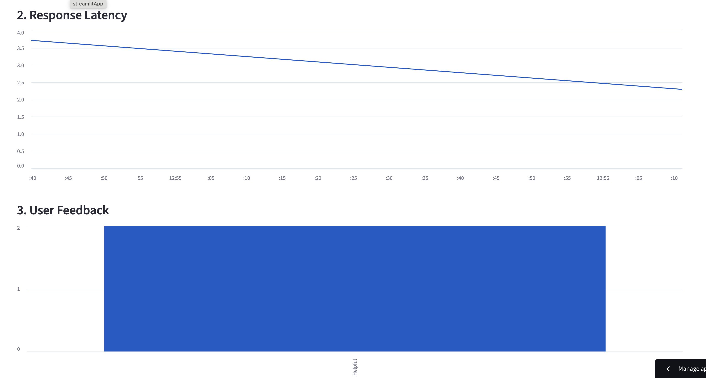

## Revenue AI Copilot

> Turning specialized Revenue Management knowledge into fast, grounded, and traceable answers.

🚀 **[Live Demo](https://revenue-ai-copilot-2pgrnlgyantu75qnaet59x.streamlit.app)**

Revenue AI Copilot is a Retrieval-Augmented Generation (RAG) application designed to help hotel Revenue Management professionals access specialized knowledge through natural-language questions.

The system retrieves relevant information from a curated Revenue Management knowledge base and uses a Large Language Model to generate answers grounded in the retrieved documentation.

The project was developed as part of the **DataTalksClub LLM Zoomcamp** and demonstrates a complete production-oriented RAG workflow including document ingestion, semantic retrieval, retrieval evaluation, LLM evaluation, a conversational interface, user feedback, application monitoring, containerization, and cloud deployment.

### Key Features

- 🔎 Semantic retrieval over a specialized Revenue Management knowledge base
- 🤖 Grounded RAG answers with source and page attribution
- 🌍 Multilingual questions and answers
- 📊 Retrieval and end-to-end RAG evaluation
- 👍 User feedback collection
- 📈 Application monitoring dashboard
- 🐳 Dockerized application
- ☁️ Public deployment on Streamlit Community Cloud

---

## Problem Description

Hotel Revenue Management involves working with large amounts of specialized information covering topics such as:

- Pricing strategies
- Demand forecasting
- Market segmentation
- Distribution channels
- Revenue KPIs
- Revenue optimization

This information is often distributed across manuals, guides, reports, and other documentation.

Finding the right information quickly can be difficult, particularly when Revenue Managers need to make decisions based on specific business situations.

Revenue AI Copilot addresses this problem by transforming specialized Revenue Management documents into a searchable knowledge base.

Users can ask questions in natural language and receive answers grounded in the retrieved documentation, including references to the original sources and pages.

---

## Why Revenue Management?

Revenue Management was selected because it combines complex documentation, analytical decision-making, pricing strategy, forecasting, distribution, and real operational challenges.

Professional experience in this domain also made it possible to develop the project around realistic Revenue Management questions and workflows rather than hypothetical examples.

The architecture itself is domain-independent and could later be adapted to other knowledge-intensive business areas.

---

## Application

Revenue AI Copilot provides a conversational Streamlit interface where users can ask Revenue Management questions.

The application includes:

- Conversational chat interface
- Semantic knowledge retrieval
- Grounded LLM-generated answers
- Source and page attribution
- Retrieved-source similarity scores
- Example questions
- Conversation history
- User feedback (`Helpful` / `Not helpful`)
- Application monitoring dashboard

---

### Application Preview



The application retrieves relevant knowledge-base content and generates grounded answers with source and page attribution.

### Live Demo

The application is publicly deployed on Streamlit Community Cloud:

👉 **[Open Revenue AI Copilot](https://revenue-ai-copilot-2pgrnlgyantu75qnaet59x.streamlit.app)**

The deployed application uses the same semantic retrieval and RAG pipeline evaluated in this repository.

The semantic index is stored separately from the public repository and is securely downloaded at application startup. This keeps the source documents and extracted knowledge-base content out of the public code repository while allowing the deployed application to use the pre-built index.

---

### Example Questions

- What is RevPAR?
- What is hotel Revenue Management?
- How does dynamic pricing work?
- Why is market segmentation important?
- How can hotels improve revenue during periods of low demand?
- What is channel management?

---

## RAG Architecture

The current application follows this pipeline:

```text
Revenue Management PDFs
          ↓
PDF ingestion
          ↓
Text extraction & cleaning
          ↓
Document chunking
          ↓
Embedding generation
          ↓
Persistent semantic index
          ↓
Semantic Search (Top-5)
          ↓
Context construction
          ↓
Groq-hosted LLM
          ↓
Grounded answer
          ↓
Source attribution
          ↓
Streamlit interface
          ↓
Feedback & Monitoring
```

The application separates ingestion, retrieval, generation, evaluation, and monitoring into independent components.

### Production Deployment Architecture

The public application is deployed on **Streamlit Community Cloud**.

Because the original PDF documents and the extracted semantic index are not distributed through the public repository, the production deployment uses a separate private asset repository.

```text
Public GitHub Repository
        ↓
Streamlit Community Cloud
        ↓
Check for semantic index
        ↓
Private GitHub Release Asset
        ↓
Download semantic_index.json
        ↓
Load 358 indexed document chunks
        ↓
Revenue AI Copilot
```

At application startup, the system checks whether the semantic index is available locally. If it is missing in the cloud environment, the application securely downloads the pre-built index from a private GitHub release using a read-only access token stored in Streamlit Secrets.

This architecture allows the application code to remain fully public while keeping the source PDFs and extracted knowledge-base content outside the public repository.

---

## Knowledge Base

The current knowledge base consists of specialized Hotel Revenue Management PDF documents.

During ingestion, the documents are:

1. Loaded from the source directory.
2. Extracted page by page.
3. Cleaned and normalized.
4. Split into smaller chunks.
5. Assigned metadata including source document, page, and chunk ID.
6. Converted into embeddings for semantic retrieval.

The current knowledge base contains:

**183 PDF pages → 358 searchable chunks**

The original PDFs are not included in the public repository because source documents may have their own copyright and redistribution restrictions.

Users wishing to reproduce the project should place their permitted source PDFs inside:

```text
data/raw/
```

and rebuild the semantic index.

---

## Semantic Search

The production retrieval system uses semantic search.

Document embeddings are generated once during index construction and stored in a persistent semantic index.

At query time:

1. The user question is converted into an embedding.
2. Its similarity with the indexed document chunks is calculated.
3. The most relevant chunks are retrieved.
4. The Top-5 results are passed to the RAG pipeline.

Persisting the document embeddings prevents the entire knowledge base from being embedded every time the application starts.

---

## Retrieval Evaluation

A dedicated evaluation dataset containing **50 Revenue Management questions** was created from the knowledge base.

Each evaluation question contains a known relevant document, allowing retrieval quality to be measured using:

- **Hit Rate@5**
- **MRR@5 (Mean Reciprocal Rank)**

Multiple retrieval strategies were evaluated.

| Retrieval Method | Hit Rate@5 | MRR@5 |
|---|---:|---:|
| Keyword Search | 0.7800 | 0.6907 |
| Semantic Search | 0.8400 | 0.7357 |
| Hybrid RRF (50/50) | 0.8600 | 0.7257 |

Additional weighted hybrid experiments were performed:

| Semantic / Keyword Weight | Hit Rate@5 | MRR@5 |
|---|---:|---:|
| 0.6 / 0.4 | 0.8400 | 0.7367 |
| 0.7 / 0.3 | 0.8400 | 0.7267 |
| 0.8 / 0.2 | 0.8400 | 0.7467 |

Hybrid RRF achieved the highest Hit Rate@5, while the 80/20 weighted hybrid configuration achieved the highest MRR@5.

Despite these improvements, **Semantic Search (Top-5)** was selected for the production application. It provided strong retrieval performance while keeping the retrieval pipeline simpler and easier to maintain.

The hybrid experiments were retained as part of the evaluation process rather than adding additional production complexity for a relatively small improvement in retrieval metrics.

---

## End-to-End RAG Evaluation

The complete production RAG pipeline was evaluated using an **LLM-as-a-Judge** approach.

A sample of 20 evaluation questions was used to assess four dimensions:

- Relevance
- Groundedness
- Completeness
- Hallucination safety

### Results

| Metric | Average Score |
|---|---:|
| Relevance | 4.50 / 5 |
| Groundedness | 4.60 / 5 |
| Completeness | 4.40 / 5 |
| Hallucination Safety | 4.60 / 5 |

Most evaluated answers achieved high scores, while manual inspection of the main outliers revealed several distinct failure modes.

In one case, the requested information was not available in the retrieved context. The system correctly acknowledged that limitation rather than fabricating an answer, preserving maximum groundedness and hallucination safety despite lower relevance and completeness scores.

Other inspected cases revealed occasional over-interpretation of partially relevant context and retrieval limitations for highly specific questions.

These results show that end-to-end RAG quality depends on both retrieving sufficiently specific evidence and ensuring that the generation model does not extrapolate beyond the retrieved documentation.

The final production configuration retains **Semantic Search with Top-5 retrieval** and a strict context-grounded generation prompt. Query rewriting and re-ranking are identified as potential future improvements.

---

## Grounded Generation

Revenue AI Copilot is explicitly instructed to answer using only the retrieved context.

The production prompt requires the model to:

- Focus specifically on the user's question.
- Prioritize the most directly relevant retrieved context.
- Avoid combining unrelated information from retrieved chunks.
- Avoid external knowledge.
- Avoid unsupported benefits, consequences, or recommendations.
- Prefer short and precise answers over unsupported expansion.
- Answer in the same language as the user's question.
- Cite the relevant source and page for important claims.
- Clearly state when the available context does not fully answer the question.

The generation model is `openai/gpt-oss-20b`, accessed through the Groq API.

The model was evaluated as part of the complete RAG pipeline rather than assuming that model quality alone guarantees grounded answers. Prompt experiments were also evaluated to balance answer usefulness with groundedness and hallucination safety.

The final prompt prioritizes traceability and factual support over generating longer answers when the retrieved documentation does not provide sufficient evidence.

---

## User Feedback

Users can evaluate individual answers directly from the chat interface using:

- 👍 Helpful
- 👎 Not helpful

Feedback is associated with the corresponding interaction and persisted in a local SQLite database.

This provides a foundation for identifying weak answers and improving the RAG system over time.

---

## Monitoring

The application records operational information for each interaction, including:

- Timestamp
- User question
- Generated answer
- Response latency
- Number of retrieved sources
- User feedback

Monitoring data is stored in SQLite.

A dedicated Streamlit monitoring page provides summary metrics and visualizations covering:

1. Questions over time
2. Response latency over time
3. User feedback distribution
4. Retrieved sources per question
5. Latency distribution

The dashboard also displays overall metrics such as total questions, average latency, feedback responses, and positive feedback.

### Monitoring Preview



The monitoring dashboard tracks application usage, response latency, and user feedback.



---

## Project Structure

```text
revenue-ai-copilot/
│
├── app/
│   ├── build_index.py
│   ├── data_loader.py
│   ├── ingest.py
│   ├── index_download.py
│   ├── monitoring.py
│   ├── rag.py
│   ├── rag_helper.py
│   ├── search.py
│   └── semantic_search.py
│
├── pages/
│   └── 01-monitoring.py
│
├── data/
│   ├── raw/
│   ├── processed/
│   │   └── semantic_index.json
│   └── monitoring/
│       └── revenue_ai_copilot.db
│
├── 01-rag-mvp.ipynb
├── 02-load-pdfs.ipynb
├── 03-rag-working.ipynb
├── 04-semantic-search.ipynb
├── 05-evaluation.ipynb
│
├── streamlit_app.py
├── README.md
├── pyproject.toml
├── uv.lock
├── .python-version
└── .gitignore
```

---

## Notebooks

The notebooks document the development and experimentation process.

### `01-rag-mvp.ipynb`

Initial Retrieval-Augmented Generation prototype.

### `02-load-pdfs.ipynb`

PDF loading and document ingestion experiments.

### `03-rag-working.ipynb`

Working RAG pipeline and retrieval experiments.

### `04-semantic-search.ipynb`

Semantic retrieval and embedding experiments.

### `05-evaluation.ipynb`

Evaluation pipeline including:

- Evaluation dataset generation
- Keyword retrieval evaluation
- Semantic retrieval evaluation
- Hybrid retrieval experiments
- Hit Rate and MRR
- End-to-end RAG evaluation
- LLM-as-a-Judge
- Error analysis

---

## Tech Stack

- **Python**
- **Streamlit** — application interface and monitoring dashboard
- **OpenAI API** — embedding generation with `text-embedding-3-small`
- **Groq API** — LLM inference using `openai/gpt-oss-20b`
- **SQLite** — interaction and feedback monitoring
- **Pandas** — monitoring data processing
- **PyPDF** — PDF ingestion
- **NumPy** — semantic similarity calculations
- **MinSearch / lexical retrieval** — retrieval experiments
- **Jupyter Notebook** — experimentation and evaluation
- **uv** — dependency and environment management

---

## Installation

Clone the repository:

```bash
git clone https://github.com/inetke/revenue-ai-copilot
cd revenue-ai-copilot
```

Install the project dependencies:

```bash
uv sync
```

Create a `.env` file in the project root:

```text
OPENAI_API_KEY=your_openai_api_key
GROQ_API_KEY=your_groq_api_key
```

Do not commit this file to version control.

---

## Adding the Knowledge Base

Place the Revenue Management PDF documents inside:

```text
data/raw/
```

Then build the semantic index:

```bash
uv run python -m app.build_index
```

A persistent semantic index will be created under:

```text
data/processed/semantic_index.json
```

---

## Running the Application

Start the Streamlit application:

```bash
uv run streamlit run streamlit_app.py
```

Open the URL displayed by Streamlit.

The main page provides the Revenue AI Copilot chat interface.

The **Monitoring** page is available from the Streamlit navigation menu.

---

## Running with Docker

The application can also be executed inside a Docker container for a reproducible environment.

Build the Docker image:

```bash
docker build -t revenue-ai-copilot .
```

Run the container using the required API keys and mounting the local knowledge base:

```bash
docker run --rm \
  -p 8501:8501 \
  --env-file .env \
  -v "$(pwd)/data/raw:/app/data/raw:ro" \
  revenue-ai-copilot
```

The application will be available on port `8501`.

If the semantic index does not exist, the application can obtain it in two ways:

- If `GITHUB_ASSETS_TOKEN` is configured, the pre-built semantic index is downloaded from the private release asset.
- Otherwise, if permitted PDF documents are available in `data/raw/`, the semantic index is built locally from those documents.

The source documents are not included in the public repository or Docker image.

---

## Environment Variables

For local development, the application requires:

```text
OPENAI_API_KEY
GROQ_API_KEY
```

- `OPENAI_API_KEY` is used to generate semantic embeddings.
- `GROQ_API_KEY` is used for LLM answer generation.

The cloud deployment additionally uses:

```text
GITHUB_ASSETS_TOKEN
```

- `GITHUB_ASSETS_TOKEN` provides read-only access to the private release asset containing the pre-built semantic index.

In production, secrets are stored securely in **Streamlit Secrets** and are not exposed in the public repository.

Secrets must never be committed to version control.

---

## Current Status

- [x] PDF ingestion
- [x] Text preprocessing
- [x] Document chunking
- [x] Keyword retrieval
- [x] Semantic retrieval
- [x] Persistent semantic index
- [x] Retrieval evaluation
- [x] Hybrid retrieval experiments
- [x] End-to-end RAG evaluation
- [x] LLM-as-a-Judge evaluation
- [x] Source attribution
- [x] Streamlit chat interface
- [x] Conversation history
- [x] Example questions
- [x] User feedback
- [x] SQLite interaction logging
- [x] Monitoring dashboard
- [x] Docker containerization
- [x] Public deployment

---

## Project Evaluation Criteria

This project was developed as the final project for the DataTalksClub LLM Zoomcamp and covers the main evaluation criteria:

| Evaluation Criterion | Implementation |
|---|---|
| Problem Description | Hotel Revenue Management use case and business problem clearly defined |
| Retrieval Flow | Semantic retrieval over a five-document Revenue Management knowledge base |
| Retrieval Evaluation | 50-question evaluation comparing keyword, semantic, Hybrid RRF, and weighted hybrid retrieval |
| LLM Evaluation | 20-question end-to-end RAG evaluation using LLM-as-a-Judge across relevance, groundedness, completeness, and hallucination safety |
| Interface | Interactive Streamlit chat application |
| Ingestion Pipeline | Python pipeline for PDF ingestion, chunking, embedding generation, and semantic index creation |
| Monitoring | SQLite-based monitoring with usage, latency, source retrieval, and user-feedback metrics |
| Containerization | Dockerfile provided for reproducible application execution |
| Reproducibility | Installation, environment configuration, knowledge-base setup, and execution instructions documented in this README |
| Hybrid Search | Multiple hybrid retrieval strategies evaluated against pure semantic retrieval |
| Cloud Deployment | Application deployed publicly on Streamlit Community Cloud |

### Additional Engineering Features

Beyond the core project requirements, the project includes:

- Source and page attribution for grounded answers
- Multilingual responses based on the user's query language
- Explicit handling of insufficient context
- Manual analysis of RAG failure cases
- User feedback collection
- Operational monitoring dashboard
- Private semantic-index distribution for cloud deployment
- Separation between public application code and copyrighted source documents

---

## Future Improvements

Peer evaluation highlighted several opportunities for future iterations:

- **Improve source transparency** by displaying short excerpts from retrieved passages directly in the UI, alongside document and page references.
- **Improve reproducibility** by providing a small openly licensed or synthetic sample knowledge base that allows the ingestion pipeline to be tested without the copyrighted source documents.
- **Evaluate hybrid retrieval for production**, as hybrid configurations achieved stronger retrieval metrics during experimentation than the semantic-search baseline currently used by the deployed application.
- **Extend RAG evaluation** by comparing multiple prompt and pipeline configurations.
- **Explore query rewriting and reranking** to improve retrieval quality for more difficult or ambiguous questions.
---

## Long-Term Vision

Revenue AI Copilot is the first implementation of a broader architecture for AI-assisted access to specialized business knowledge.

Revenue Management provides a useful environment for validating RAG, semantic retrieval, grounded generation, evaluation, and monitoring because it combines complex documentation with real business decision-making.

The same architecture could eventually be adapted to other knowledge-intensive domains while maintaining reliable retrieval, transparent source attribution, and measurable answer quality.

---

## Disclaimer

Revenue AI Copilot is an educational and portfolio project.

The application generates answers based on the documents available in its knowledge base. Its responses should not replace professional judgment, internal company policies, validated operational data, or commercial decision-making.
